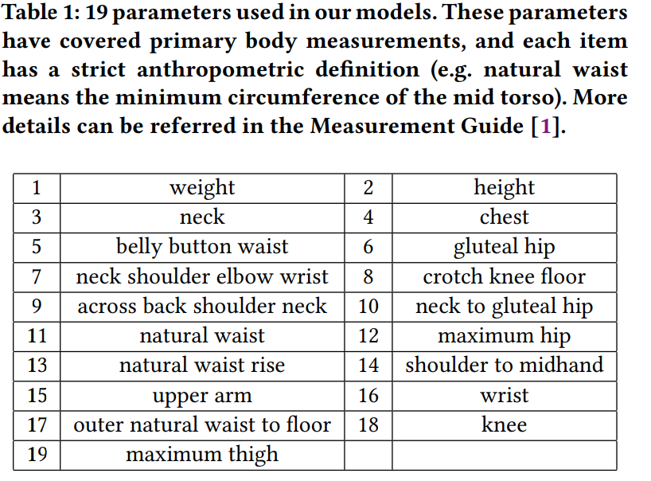
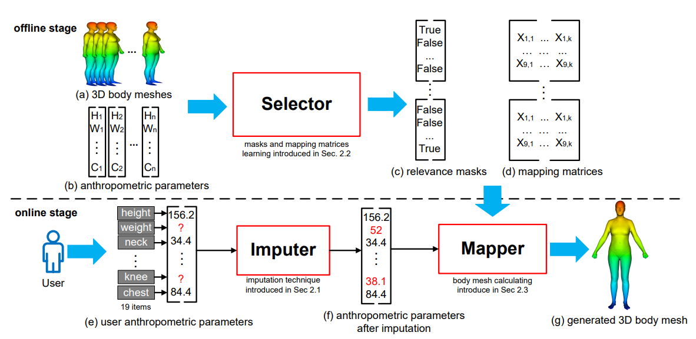

# 3D Human Body Reshaping with Anthropometric Modeling

# 解决的问题

避免了三维人体复杂的建模方式：

- 手工测量标定参数，规则不固定，失去统计意义
- 专业相机或扫描仪，花费大，实用性小

使用直观显性的参数对人体进行建模，提出feature-selection-based local mapping technique，用于限制用户输入。

&nbsp;

## 提出的方法

1. 通过用户有限的输入（19个）计算出完整的人体参数作为重建的基础 Multivariate Imputation by Chained Equations（MICE）

&nbsp;

1. 选择相关性最高的参数来采集掩膜，这是一个offline的过程（论文提出的local mapping technique）
2. 通过mapping matrices生成3Dmeshes，这个matrices是由第二步选择到的参数线性回归得到的。

&nbsp;

## 流程

用户输入（0<items<=19）不足的系统补全(MICE 多重补填法)

Seclector --> 一个学习的过程，用于学习相关性掩膜并且映射成矩阵

## 额外内容

- 3D 人体形状解析分为两类：
  1. point-based

