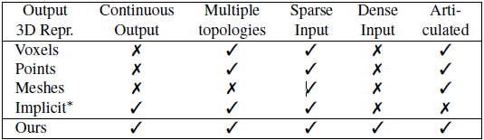

# Implicit Functions in Feature Space for 3D Shape Reconstruction and Completion

## 解决的问题

3D inputs are deficient in some respect:

- Low and high resolution voxels.
- Sparse and dense point clouds.
- Complete or incomplete.

**Limitations in reconstruction from 3D inputs:**

1. Details present in the input data are not retained.
2. Poor reconstruction of articulated humans(铰链式).

**Reason Hypothesizes**

- Learn an overly strong prior on x-y-z point coordinates damaging the invariance to articulation.
- Encoding vector lacks the 3D structure, resulting in decodings that look more like classifications into shape prototypes rather than continuous regression.

## 提出的方法

***Implicit Feature Networks(IF-Nets)***

- 3-dimensional multi-scale tensor of deep features.(aligned with Euclidean space embedding the shape)
- Classify deep features extracted from the tensor at a continuous query point.

不会去存储x-y-z的位置，使得模型能够在全局和局部结构下进行决策，并且能在欧式距离下任意转换。

## 引言

文章主要解决的在各种各样的3D输入下的表面重建和形状补全。主要想要生成可渲染的连续的、完整的表面。

**Sparse grids and (incomplete) point clouds:** 受制于输出的表征形式。

**Mesh-based:** 无法表达多样的拓扑结构（只变形初始的模型）。

**Voxel-based**: 大量的内存需要，输出过于粗糙，没有细节。

**Point Cloud**: 不易渲染和可视化。

**基于隐函数(Implicit function)的重建**

粗糙形状编码作为向量，判断x-y-z(队列点)是否在形状内部。

可以用于任意分辨率。

表面能够提取并使用任意的cubes算法。

***基于隐函数的渲染***

- [Deep SDF][https://arxiv.org/pdf/1901.05103.pdf]

- [Learning 3d reconstruction in function space][https://arxiv.org/pdf/1812.03828.pdf]

- [Learning implicit fields for generative shape modeling][https://arxiv.org/pdf/1812.02822.pdf]
- [Pixel-aligned implicit function for high-resolution clothed human digitization][https://arxiv.org/pdf/1905.05172.pdf]

作者从五个不同情况的输入进行实验（下面是作者展示时间）。

不同于上述三篇论文：

1. 在欧氏空间上进行形状embedding的多尺度tensor
2. 在连续的序列点上进行分类，而不是直接x-y-z

## 相关工作

**表征分类：**体素，点云，网格，隐函数

**用途分类：**刚性重建(物体)，人体重建

- 体素：受限于分辨率，无法补全不完整的人体
- 网格：能够构建比较思华的细节，但是受限于网格本身的模板，策略只适用于一个重建人体。
- 点云：无法被渲染。
- 隐函数：基于3D点的有序点和2D的图像特征，之前的工作无法完成复杂姿势的重建，同时只专注于图像的重建，而不是3D输入的重建。

## 方法

